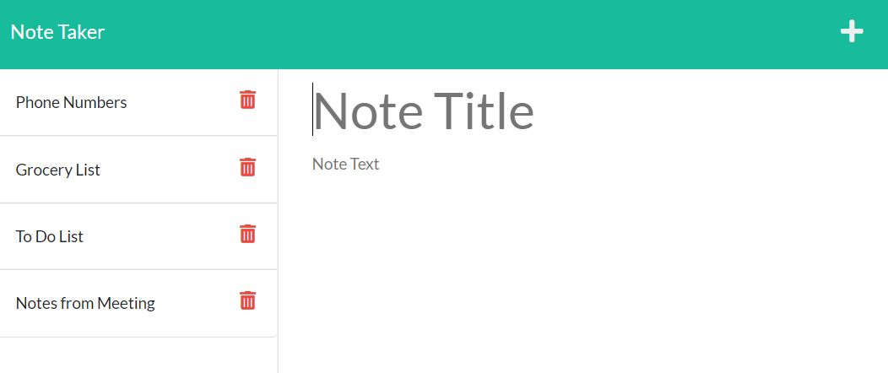

# Note Taker Application 

## Description

I created an application called Note Taker that can be used to write, save and delete notes. This application was created using Express.js and the notes are stored in a JSON file. I built this application so users can successfully keep track of important notes. Creating this application taught me how to successfully connect the front end to the back end of the application and deploy it to Heroku. 

## Installation

To install please run the following commands:

        npm i
        node server.js

## Usage 

Below is a picture of the application: 

Below is the link to the deployed application:

## Questions 

Please find me on GitHub [nicolepingar](https://github.com/nicolepingar) or email me at nicolepingar@gmail.com.

